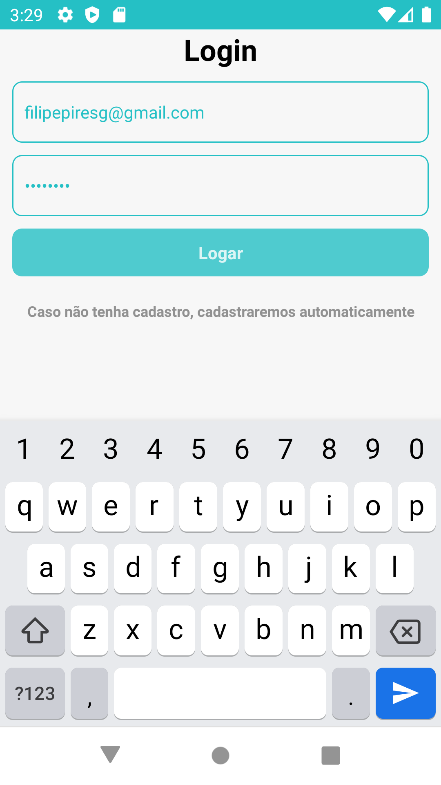

# Gorila Investimento

- [Gorila Investimento](#gorila-investimento)
  - [Solução](#solução)
  - [Funcionamento](#funcionamento)
    - [Resumo](#resumo)
    - [Ferramentas utilizadas](#ferramentas-utilizadas)
  - [Como rodar](#como-rodar)
  - [Screenshots](#screenshots)

## Solução

Projeto criado com o comando `react-native` utilizando a versão 0.63.4. Segue as definições do [teste técnico](https://www.notion.so/Teste-Gorila-Front-End-c9b2983ddcb04492865fe796d0ec20cc).
Algumas questões precisam ser relatadas:

- O teste parece para full stack, então algumas coisas foram ignoradas
  - Como o fato de `hospedar` o backend
  - Ou de utilizar ao menos `3 endpoints` para serem consumidos.
- Foi feito como `One Single Page`, como propósito, e isso inviabiliza a customização/estilização da tela, de forma mais ampla.

O apk (versão android) pode ser [baixado aqui](https://github.com/filipepiresg/react-native-investiment/releases)

Roda em dispositivos Apple (iOS) e em Android.

## Funcionamento

Por um requisito (ser single page), foi componentizado o login e a tela principal. Ao qual, assim que é feito o login/cadastro é rerenderizado o conteúdo principal do app.
Logado, o usuário pode criar/excluir novos investimentos, além de resetar o conteúdo do header, caso necessite. Abaixo, é possível visualizar as listas de ativos de renda fixa ou variável, além de que é possível visualizar o gráfico ao final da tela.

No login, deve ser inserido um email e uma senha (**de 4 até 8 caracteres**), se o e-mail já estiver sido cadastrado o usuário vai logar diretamente, caso o email não seja cadastrado, irá cadastrar e logar (automagicamente). **_Autenticação feita via Firebase._**

### Resumo

Na tela principal, num primeiro momento, o usuário só terá uma tela para add novos investimentos, passando dados como o tipo de renda, o valor do investimento (**deve ser maior que 0**) e a data investida (**note:** só poderá ser adicionado datas anterios, de um ano antes até o dia atual). Em seguida, poderá ser pressionado 2 botões: o resetar irá resetar os dados posteriormente adicionados ou o botão "**+**", que serve para adicionar o investimento no _firestore_.
Caso, já tenha sido adicionado algum investimento, será visualizada 2 listas exibindo data e o valor de cada transação e abaixo o gráfico com percentual das rendas investidas. Para remover uma transação, é simples, somente pressionar a transação que queira remover, ela irá ser exibida na parte de cima da tela e no lugar do botão "**+**", será exibido o "**excluir**", que irá remover no _firestore_.

### Ferramentas utilizadas

- React-Native
- Styled-Components
- Firebase
- Rea˜totron (para debug)
- Configuracões de Eslint/Prettier/Commitlint para legibilidade do código/projeto

## Como rodar

Após ser feito o clone do projeto, pode-se instalar diretamente em celulares android's utilizando o apk na aba [release](https://github.com/filipepiresg/react-native-investiment/releases), para rodar como ambiente de release do apk. Caso esse não seja o desejo, deve-se instalar as dependências com o comando `yarn install` (ou `npm install`), depois então pode rodar o start com o comando `yarn start` (ou `npm start`), e em seguida rodar o simulador/emulador que deseje, para android `yarn android` (ou `npm run android`), e ou para ios `yarn ios` (ou `npm run ios`)

## Screenshots

- Android
  - 
    - Go to [android screenshots](./screenshots/android)
- iOS
  - 
    - Go to [ios screenshots](./screenshots/ios)
