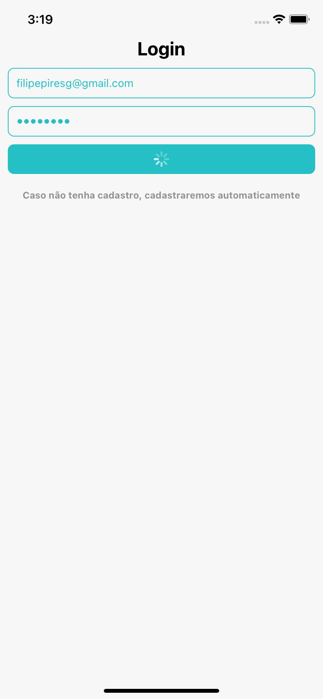

# Gorila Investimento

- [Gorila Investimento](#gorila-investimento)
  - [Solucão](#solucão)
  - [Funcionamento](#funcionamento)
  - [Como rodar](#como-rodar)
  - [SCREENSHOTS](#screenshots)

## Solucão

Projeto criado com o comando `react-native` utilizando a versão 0.63.4. Segue as definições do [PDF](https://www.notion.so/Teste-Gorila-Front-End-c9b2983ddcb04492865fe796d0ec20cc).
Algumas questões precisam ser relatadas:

- O teste parece para full stack, então algumas coisas foram ignoradas
  - Como o fato de `hospedar` o backend
  - Ou de utilizar ao menos 3 `endpoints` para serem consumidos.
- Foi feito como `One Single Page`, como proposto, e isso inviabiliza a customizacão/estilizacão da tela, de maneira mais ampla.

Pode ser baixado o apk (versão android) [aqui](https://github.com/filipepiresg/react-native-investiment/releases)

Roda em dispositivos Apple (iOS) e em Android.

## Funcionamento

Por ser um requisito (de ser single page), foi componentizado o login e a tela principal. Ao qual, assim que é feito o login/cadastro é rerenderizado o conteúdo principal do app.
Logado, o usuário pode criar/excluir novos investimentos, além de resetar o conteúdo do header, caso necessite. Abaixo, é possível visualizar as listas de ativos de renda fixa ou variável, além de que é possível visualizar o gráfico ao final da tela.

Ferramentas utilizadas foram:

- React-Native
- Styled-Components
- Firebase
- Reactotron (para debug)
- Configuracões de Eslint/Prettier/Commitlint para legibilidade do código

## Como rodar

Após ser feito o clone do projeto, pode-se instalar diretamente em celulares android's utilizando o apk na aba [release](https://github.com/filipepiresg/react-native-investiment/releases), para rodar como ambiente de release do apk. Caso esse não seja o desejo, deve-se instalar as dependencias com o comando `yarn install` (ou `npm install`)pode-se rodar o start com o comando `yarn start` (ou `npm start`), e em seguida rodar com o simulador/emulador que deseje, para android `yarn android` (ou `npm run android`), e ou para ios `yarn ios` (ou `npm run ios`)

## SCREENSHOTS

- Android
  - 
    - Go to [android screenshots](./screenshots/android)
- iOS
  - 
    - Go to [ios screenshots](./screenshots/ios)
